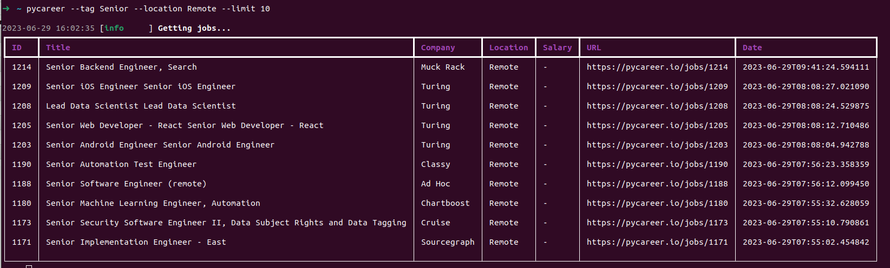

# PyCareer

## Python Jobs in Your Terminal!

[](https://pepy.tech/project/pycareer)



### Usage:


You can query Python jobs based on 2 parameters:
- tag
- location

```python
pycareer --tag Senior --location Remote
```


Default amount of jobs returned is 5 but you can configure this limit:


```python
pycareer --tag Senior --location Remote --limit 10
```

All jobs are sorted by date, so you will see the most recent jobs first.

### Installation:

```python
pip install pycareer
```

Now you will have access to the CLI.

So, just open your terminal and let's go!
Find your perfect job!

Sign up on https://www.pycareer.io and list your profile! 
Employers will chase you for your Python skills!
